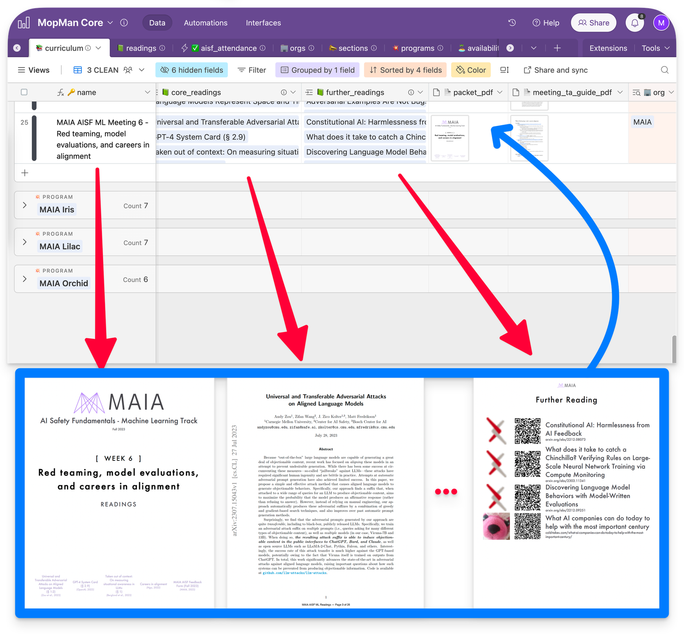
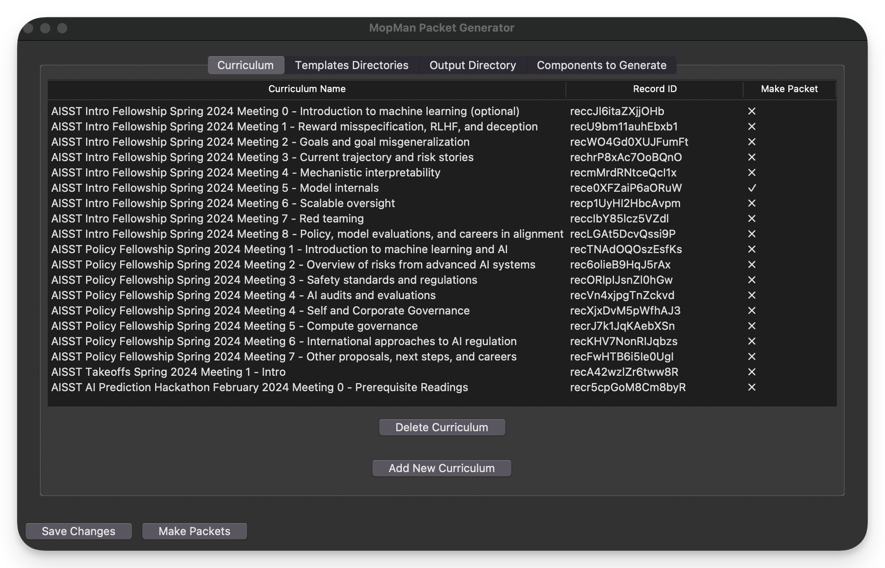
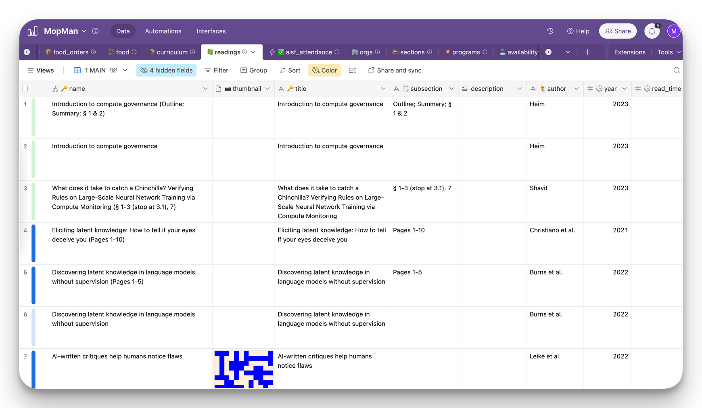

# MopMan PacketMaker
Interface written in Python to automatically retrieve program info from Cambridge-Boston Alignment Initiative’s AirTable and generate professional looking PDF Packets using said info.

 
*Diagram of how the MopMan PacketMaker works.*

*Main page of the PacketMaker GUI. Here you are able to add and select which packets you would like to compile.*

View an example of an auto-generated packet [here](imgs/AISSTIntroW5.pdf).

More info can be found [here](https://www.notion.so/gatlen/MopMan-PacketMaker-a62ed64c69f2440bbde8b0212de773df?pvs=4)

## The MopMan Project

*MopMan Logo*

*MopMan Example Table*

[MopMan (MAIA Operations Manager)](https://www.notion.so/gatlen/MopMan-758102ee41b944e486ebfad586309fc7?pvs=4) is a collection of services, scripts, and AirTables that manage the operations and logistics of the non-profit [MAIA (MIT AI Alignment)](https://www.mitalignment.org/). Documentation [here](https://mitalignment.notion.site/MopMan-Documentation-9bbc80b1f07744458712211f4817dfc1).

Author: Gatlen Culp (GatlenCulp@gmail.com, [gatlen.notion.site](https://gatlen.notion.site))